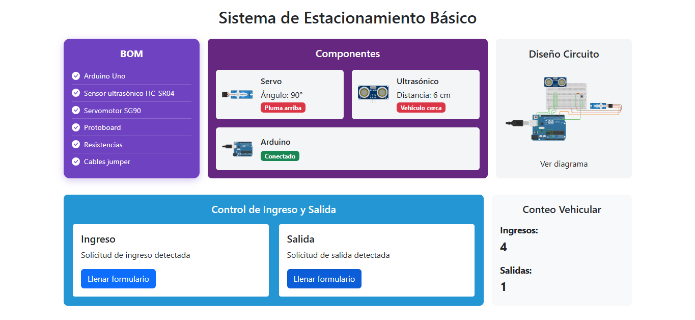
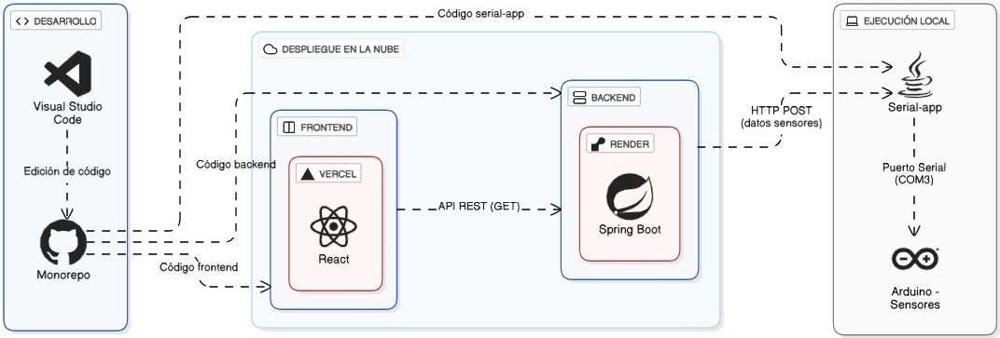

# 🚗 Sistema de Estacionamiento Inteligente Básico - Monorepo

Este repositorio contiene el código completo del sistema de estacionamiento inteligente, organizado en tres módulos principales:

- **backend**: API REST desarrollada en ```Spring Boot``` para la gestión y recepción de datos.
- **frontend**: Aplicación web en ```React + TypeScript``` para la visualización del estado en tiempo real.
- **serial-app**: Aplicación Java que se comunica con el hardware Arduino vía puerto serial y envía datos al backend.

## 📂 Estructura del Proyecto
```yaml
sistema-estacionamiento-inteligente-app/
├── backend/        # API REST con Spring Boot
├── frontend/       # Aplicación web con React + Vite
├── serial-app/     # Aplicación Java para comunicación serial
├── .gitignore
└── README.md       # Este archivo
```

## 🚀 Cómo empezar

### 1. Backend

- Ubicación: `/backend`
- Requisitos: JDK 21+, Maven
- Configuración: Archivo `.env` con variable `FRONTEND_URL`
- Dockerfile incluido para contenedorización

```bash
cd backend
mvn clean install
mvn spring-boot:run
```
### 2. Frontend

- Ubicación: `/frontend`
- Requisitos: Node.js, npm
- Configuración: Archivo `.env` con variable `VITE_API_URL`

```bash
cd frontend
npm install
npm run dev
```
### 3. Serial App

- Ubicación: `/serial-app`
- Requisitos: JDK 21+, Maven
- Configuración: Archivo `.env` con variable `BACKEND_URL`

```bash
cd serial-app
mvn exec:java
```
## 🌐 Variables de Entorno
Cada módulo tiene su propio archivo `.env` para configurar URLs y parámetros clave:

| Módulo | Archivo `.env` | Variables principales |
| --- | --- | --- |
| backend | backend/.env | `FRONTEND_URL` |
| frontend | frontend/.env | `VITE_API_URL` |
| serial-app | serial-app/.env | `BACKEND_URL` |

## 🛠️ Tecnologías usadas

| Módulo | Tecnologías |
| --- | --- |
| backend | Java 21, Spring Boot, Maven, Docker |
| frontend | React, TypeScript, Vite, npm |
| serial-app | Java 21, jSerialComm, Maven |

## 📷 Vista del Dashboard del sistema



> La imagen muestra el estado en tiempo real con datos de los sensores y el Arduino.

## 💻 Arquitectura del Sistema de Estacionamiento Inteligente Básico



> El diagrama muestra la arquitectura base del sistema, incluyendo el despliegue en la nube y la ejecución local de sus componentes principales.

## 📚 Sobre el Proyecto

Este proyecto fue desarrollado como parte de la materia **Programación de Sistemas**, como proyecto final del curso.