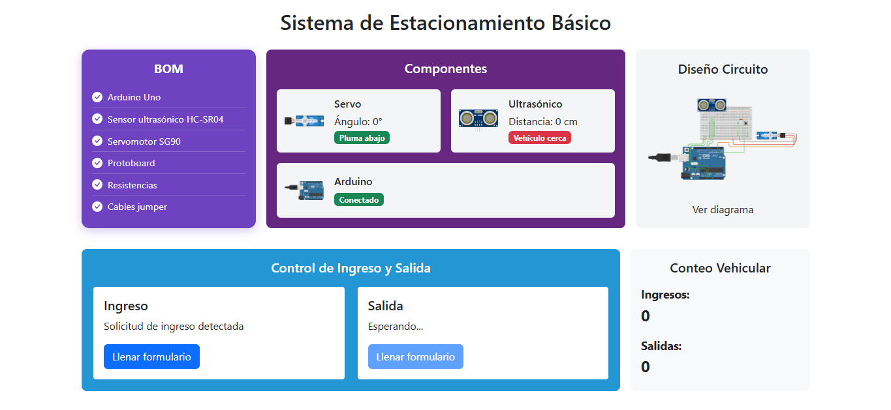

# 🖥️ Backend - Sistema de Estacionamiento Inteligente Básico

Este módulo implementa la API REST con **Spring Boot** para manejar la lógica del sistema de estacionamiento inteligente. Recibe datos del Arduino vía serial-app y sirve información para el frontend.

## 🧠 Estructura del Proyecto
```yaml
backend/
├── src/
│ └── main/
│ ├── java/
│ │ └── com/
│ │ └── estacionamiento/
│ │ ├── EstacionamientoApplication.java     # Clase principal Spring Boot
│ │ ├── config/
│ │ │ └── WebConfig.java                    # Configuración CORS usando dotenv
│ │ ├── controller/
│ │ │ └── SensorDataController.java         # Endpoints REST
│ │ ├── dto/
│ │ │ ├── SensorDataDTO.java                # DTO para datos recibidos
│ │ │ └── DashboardStatusDTO.java           # DTO para estado del dashboard
├── pom.xml                                 # Configuración Maven
├── .env                                    # Variables de entorno
├── Dockerfile                              # Configuración para contenerización
...
```

## ⚙️ Instalación y Ejecución Local

```bash
# 1. Entrar al directorio backend
cd backend

# 2. Construir el proyecto con Maven
mvn clean install

# 3. Ejecutar la aplicación
mvn spring-boot:run
```
Por defecto, la API corre en: `http://localhost:8080/api`

## 🌐 Variables de Entorno
Crear un archivo `.env` en la raíz de backend con:

```properties
FRONTEND_URL=https://tu-frontend-url.com
```
Esta variable configura el origen permitido para CORS, habilitando la comunicación con el frontend desplegado.

## ⚙️ Configuración CORS con .env
El backend utiliza una clase de configuración para gestionar CORS dinámicamente con la variable de entorno FRONTEND_URL.

El archivo `.env` debe incluir:

```properties
FRONTEND_URL=https://tu-frontend-url.com
```
El `WebConfig` lee esta variable usando la librería dotenv-java y permite que solo el frontend autorizado pueda hacer peticiones a la API.

Esto facilita cambiar el origen permitido sin modificar el código.

## 🐳 Docker
El backend incluye un `Dockerfile` para crear una imagen Docker y facilitar el despliegue.

Construir la imagen
```bash
docker build -t estacionamiento-backend .
```
Ejecutar el contenedor
```bash
docker run -d -p 8080:8080 --env-file .env --name backend estacionamiento-backend
```
## 🛠️ Endpoints disponibles
`POST /api/sensor-data` — Recibe datos enviados por Arduino

`GET /api/dashboard-status` — Retorna el estado actual para el dashboard del frontend

## 📸 Vista del Dashboard (con backend levantado, pero sin correr serial-app)

