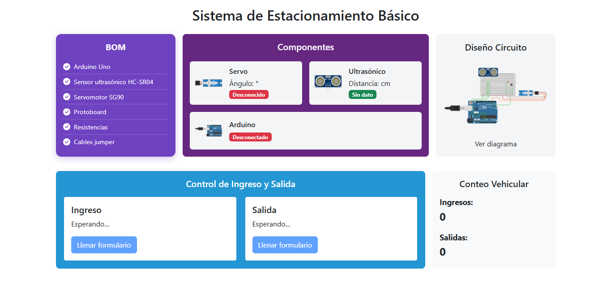

# 🎯 Frontend - Sistema de Estacionamiento Inteligente Básico

Este módulo es la interfaz visual del sistema de estacionamiento inteligente básico, desarrollada con **React + TypeScript + Vite**. Permite visualizar en tiempo real el estado del estacionamiento: distancia, posición del servo, detección de vehículo y solicitudes de salida.

## 🧠 Estructura del Proyecto
```yaml
frontend/
├── public/             # Archivos estáticos
├── src/
│ ├── assets/           # Recursos estáticos usados por componentes
│ ├── components/
│ │ └── Dashboard.tsx   # Panel principal con datos en tiempo real
│ ├── App.tsx           # Componente raíz
│ ├── main.tsx          # Punto de entrada de React
├── .env                # Variable de entorno (URL del backend)
├── package.json        # Dependencias y scripts
├── vite.config.ts      # Configuración de Vite
...
```

## ⚙️ Instalación y Ejecución Local

```bash
# 1. Ir al directorio del frontend
cd frontend

# 2. Instalar dependencias
npm install

# 3. Ejecutar en modo desarrollo
npm run dev
```
Por defecto se abre en: `http://localhost:5173`

## 🌐 Variables de Entorno
Crea un archivo `.env` en la raíz del frontend con el siguiente contenido:

```properties
VITE_API_URL=https://tu-backend-url.com
```
Esta variable conecta el frontend con el backend desplegado o local.

## 🚀 Despliegue
Este frontend está pensado para ser desplegado en Vercel.
Configuración típica en Vercel:

- [x] Framework Preset: `Vite`
- [x] Root Directory: `frontend`
- [x] Build Command: `npm run build`
- [x] Output Directory: `dist`
- [x] Install Command: `npm install`
- [x] Environment Variables: `VITE_API_URL=https://tu-backend-url.com`

## 📸 Vista del Dashboard (sin backend levantado)

