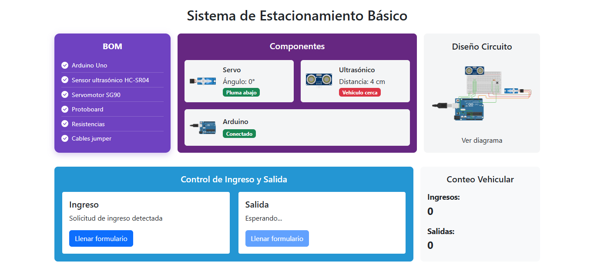
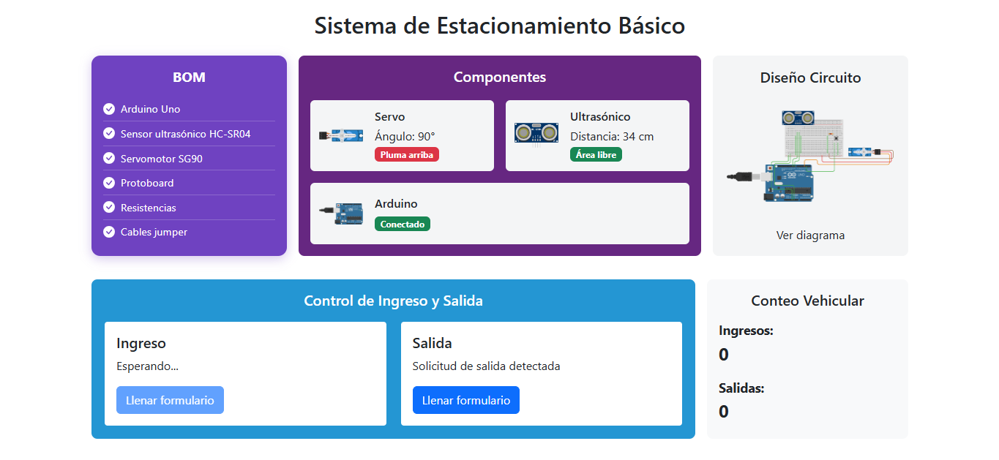

# 🚗 Serial-App - Sistema de Estacionamiento Inteligente Básico

Este módulo es la aplicación Java que se comunica con el hardware (Arduino) vía puerto serial, lee los datos de sensores y envía la información al backend REST del sistema de estacionamiento inteligente básico.

## 🧠 Estructura del Proyecto

```yaml
serial-app/
├── src/main/java/com/estacionamiento/hardware/
│   ├── SerialAppMain.java      # Clase principal que arranca la app
│   ├── SerialEmisor.java       # Envía datos al backend vía HTTP
│   └── SerialLibreria.java     # Manejo del puerto serial
├── .env                        # Variables de entorno (URL backend)
├── pom.xml                     # Configuración Maven del proyecto
└── README.md                   # Documentación del módulo
...
```
## ⚙️ Configuración

Para configurar la URL del backend donde se enviarán los datos, crea un archivo `.env` en la raíz del proyecto con el siguiente contenido:

```properties
BACKEND_URL=https://tu-backend-url.com
```

Esta variable será usada por la aplicación para saber a dónde enviar los datos recibidos del Arduino.

## 💻 Ejecución Local

Para ejecutar la aplicación, necesitas tener Maven instalado y configurado en tu sistema.

1. Navega al directorio `serial-app`:

```bash
cd serial-app
```
2. Instala dependencias y ejecuta la aplicación con:

```bash
mvn exec:java
```
> [!NOTE]
> Si mvn `exec:java` no funciona directamente, asegúrate de que en el archivo `pom.xml` está configurado el plugin `exec-maven-plugin` con la clase principal `com.estacionamiento.hardware.SerialAppMain`.

## 🛠️ Configuración del plugin en pom.xml
Para facilitar la ejecución sin argumentos adicionales, incluye este fragmento en la sección ```<build><plugins>``` de tu pom.xml:

```xml
<plugin>
    <groupId>org.codehaus.mojo</groupId>
    <artifactId>exec-maven-plugin</artifactId>
    <version>3.0.0</version>
    <configuration>
        <mainClass>com.estacionamiento.hardware.SerialAppMain</mainClass>
    </configuration>
</plugin>
```
## 📡 ¿Qué hace esta app?
Se conecta al puerto serial (ejemplo: COM3) para leer datos enviados por Arduino.

Procesa línea a línea los datos recibidos (por ejemplo: "DISTANCIA:26" o "SERVO:0").

Envía esos datos al backend configurado vía POST en ```/api/sensor-data```.

Mantiene conexión con el puerto abierto hasta que la app se cierre.

## 📂 Archivos importantes
```SerialAppMain.java:``` Punto de entrada y lógica principal de lectura y envío.

```SerialEmisor.java:``` Comunicación HTTP con backend.

```SerialLibreria.java:``` Manejo del puerto serial (abrir, leer, cerrar).

```.env:``` Variables de entorno con configuración del backend.

## 🔗 Integración
Esta aplicación debe estar en ejecución simultáneamente con el backend y el frontend para que todo el sistema funcione correctamente.

## 📸 Vista del Dashboard (con backend y serial-app levantados)



>Captura de datos del sensor ```Ultrasonido```



>Captura de datos del sensor ```Servomotor```